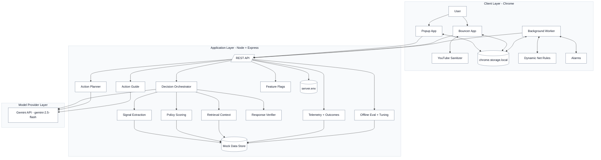
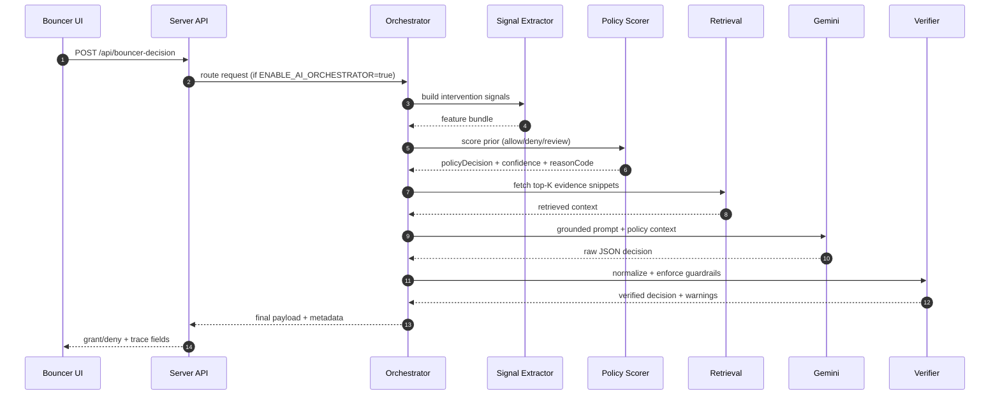

# Focus Agent Architecture Diagram

## 1) System architecture (layered)

## 2) Decision pipeline (orchestrated mode)

## 3) Rollout modes

- Orchestrated mode: ENABLE_AI_ORCHESTRATOR=true
- Legacy mode: ENABLE_AI_ORCHESTRATOR=false (LLM-only path)
- Verifier off: ENABLE_RESPONSE_VERIFIER=false
- Metadata off: ENABLE_DECISION_TRACE_METADATA=false
- Telemetry/eval APIs disabled by default unless enabled via flags
